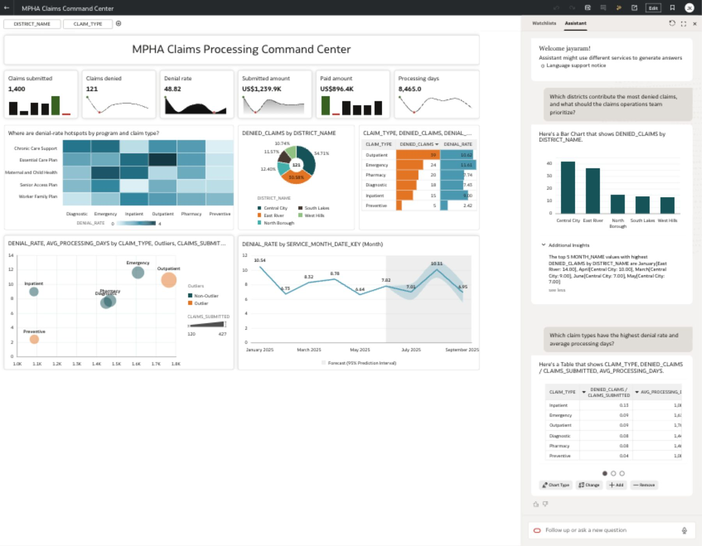

# Oracle Analytics Cloud Executive Overview Lab

## Workshop Positioning

This OAC lab is guided and uses only the Claims star schema. The Facility Access Daily dashboard remains a DIY participant challenge after the guided Claims flow.

The target workbook canvas is:

- Workbook: `MPHA Claims Command Center`
- Canvas: `Executive Overview`
- Dataset: `MPHAClaimAnalysis`
- Source model: Claims star schema in Autonomous AI Lakehouse

Target screenshot:

Screenshot-led lab references:

- `assets/oac_dashboard_lab/screenshots/01_oac_home.png`
- `assets/oac_dashboard_lab/screenshots/03_create_connection_select_type.png`
- `assets/oac_dashboard_lab/screenshots/38_oac_live_expanded_schema_self_service_model.png`
- `assets/oac_dashboard_lab/screenshots/37_oac_live_self_service_model_profile.png`
- `assets/oac_dashboard_lab/screenshots/26_dataset_inspect_search_indexing.png`
- `assets/oac_dashboard_lab/screenshots/39_oac_live_executive_overview_preview.png`
- `assets/oac_dashboard_lab/screenshots/42_oac_live_consumer_assistant_denied_claims_additional_insights.png`

## Dataset

Connect OAC to Autonomous AI Lakehouse and expose the guided Claims star schema objects:

- `MPHA_FACT_CLAIMS_MONTHLY`
- `MPHA_DIM_DATE`
- `MPHA_DIM_DISTRICT`
- `MPHA_DIM_COVERAGE_PROGRAM`
- `MPHA_DIM_CLAIM_TYPE`

Recommended joins:

- `MPHA_FACT_CLAIMS_MONTHLY.service_month_date_key` to `MPHA_DIM_DATE.date_key`
- `MPHA_FACT_CLAIMS_MONTHLY.district_key` to `MPHA_DIM_DISTRICT.district_key`
- `MPHA_FACT_CLAIMS_MONTHLY.program_key` to `MPHA_DIM_COVERAGE_PROGRAM.program_key`
- `MPHA_FACT_CLAIMS_MONTHLY.claim_type_key` to `MPHA_DIM_CLAIM_TYPE.claim_type_key`

Fast-track alternative:

- Use `MPHA_OAC_STAR_CLAIMS` if the facilitator has created a one-table OAC-serving view.

## Admin Preparation

Participants can skip this section if the facilitator has already prepared OAC.

1. Create or confirm the OAC connection to Autonomous AI Lakehouse.
   - OAC home screenshot: `assets/oac_dashboard_lab/screenshots/01_oac_home.png`
   - Create menu screenshot: `assets/oac_dashboard_lab/screenshots/02_oac_create_menu.png`
   - Connection type screenshot: `assets/oac_dashboard_lab/screenshots/03_create_connection_select_type.png`
   - AILH connection form screenshot: `assets/oac_dashboard_lab/screenshots/04_ailh_connection_form.png`
2. Create the Claims star schema dataset.
   - Dataset connection screenshot: `assets/oac_dashboard_lab/screenshots/05_create_dataset_choose_connection.png`
   - Expanded schema checkpoint: `assets/oac_dashboard_lab/screenshots/38_oac_live_expanded_schema_self_service_model.png`
3. Prepare the self-service data model.
   - Confirm the Join Diagram places `MPHA_FACT_CLAIMS_MONTHLY` at the center.
   - Confirm the fact connects to `MPHA_DIM_DATE`, `MPHA_DIM_DISTRICT`, `MPHA_DIM_COVERAGE_PROGRAM`, and `MPHA_DIM_CLAIM_TYPE`.
   - Reference screenshot: `assets/oac_dashboard_lab/screenshots/37_oac_live_self_service_model_profile.png`.
   - Use the data profiling view in the lower panel to confirm distributions, null patterns, and sample rows.
4. Confirm the fact table grain is preserved.
5. Hide purely technical fields that participants do not need in the workbook build.
6. Save the dataset as `MPHAClaimAnalysis`.
7. Enable OAC Assistant indexing:
   - open the dataset in a workbook
   - right-click `MPHAClaimAnalysis` in the data panel
   - select `Inspect`
   - open `Search`
   - set `Index Dataset For` to `Assistants and Homepage Search`
   - review the indexed field scope
   - click `Run Now`
   - screenshots: `assets/oac_dashboard_lab/screenshots/24_dataset_tree_context_menu.png`, `assets/oac_dashboard_lab/screenshots/26_dataset_inspect_search_indexing.png`, and `assets/oac_dashboard_lab/screenshots/27_dataset_inspect_search_scope.png`

## Participant Build Flow

### Step 1 - Create the Workbook Shell

1. Open `MPHAClaimAnalysis`.
2. Click `Create Workbook`.
3. Rename the first canvas to `Executive Overview`.
4. Set the canvas layout to `Freeform`.
5. Add a title text box:
   - `MPHA Claims Processing Command Center`
6. Add two dashboard filters at the top:
   - `DISTRICT_NAME`
   - `CLAIM_TYPE`

Reference screenshots:

- `assets/oac_dashboard_lab/screenshots/17_open_mpha_dataset_workbook.png`
- `assets/oac_dashboard_lab/screenshots/21_mpha_dataset_workbook_reopened.png`
- `assets/oac_dashboard_lab/screenshots/28_mpha_claims_command_center_executive_overview.png`

Design standard:

- Use a compact command-center layout.
- Keep the filters above the KPIs.
- Use round visual borders.
- Enable a light center shadow for all visuals.
- Use consistent spacing so cards do not overlap.

### Step 2 - Build the KPI Tile Band

Use OAC KPI tile visualizations with `SERVICE_MONTH_DATE_KEY (Month)` as the category column for sparklines.

| KPI title | Measure | Sparkline style |
| --- | --- | --- |
| `Claims submitted` | `CLAIMS_SUBMITTED` | Bar |
| `Claims denied` | `DENIED_CLAIMS` | Line |
| `Denial rate` | `DENIAL_RATE` | Area |
| `Submitted amount` | `TOTAL_SUBMITTED_AMOUNT` | Line with area |
| `Paid amount` | `TOTAL_PAID_AMOUNT` | Bar |
| `Processing days` | `AVG_PROCESSING_DAYS` | Line |

Formatting:

- Remove the repeated metric field title inside each KPI tile.
- Keep only the custom tile title.
- Set sparkline width and height to stretched.
- Show high and low markers when available.
- Keep all six KPI tiles in one row.

### Step 3 - Add the Denial Hotspot Heatmap

Title:

- `Where are denial-rate hotspots by program and claim type?`

Build:

- Rows: coverage program name
- Columns: claim type
- Color measure: `DENIAL_RATE`

Purpose:

- Help executives see which program and claim-type intersections require claims-quality review.

### Step 4 - Add the District Donut

Title:

- `Which districts contribute the most denied claims?`

Build:

- Value: `DENIED_CLAIMS`
- Category/color: `DISTRICT_NAME`

Design note:

- If the chart card is narrow, split the title across two lines so it does not clip.

### Step 5 - Add the Claim-Type Review Table

Title:

- `Which claim types need denial review?`

Build:

- `CLAIM_TYPE`
- `DENIED_CLAIMS`
- `DENIAL_RATE`

Formatting:

- Sort by `DENIED_CLAIMS` descending.
- Add data bars or conditional formatting to help users scan the table quickly.

### Step 6 - Add the Bubble Analysis

Title:

- `Do high-volume claim types also take longer or get denied more?`

Build:

- Label/group: `CLAIM_TYPE`
- X axis: `CLAIMS_SUBMITTED`
- Y axis: `AVG_PROCESSING_DAYS`
- Color: outlier flag or denial-risk grouping when available
- Size: `CLAIMS_SUBMITTED` or `DENIAL_RATE`, depending on which field gives the clearest visual separation in the environment

Purpose:

- Show whether high-volume claim types also have longer processing cycles or denial exposure.

### Step 7 - Add the Denial-Rate Trend

Title:

- `How is the denial rate trending month over month?`

Build:

- Category axis: `SERVICE_MONTH_DATE_KEY (Month)`
- Measure: `DENIAL_RATE`

Optional analytics:

- Add forecast or prediction interval if available in the OAC analytics options.

### Step 8 - Test OAC Assistant

Use Assistant only for indexed Claims star schema questions.

Reference screenshot:

- `assets/oac_dashboard_lab/screenshots/42_oac_live_consumer_assistant_denied_claims_additional_insights.png`

Recommended prompts:

- `Which districts contribute the most denied claims, and what should the claims operations team prioritize?`
- `Which claim types need denial review?`
- `Compare denied claims and processing days by claim type.`
- `How is denial rate trending by month?`

For the first prompt, expand `Additional Insights` in the Assistant response before taking the participant checkpoint screenshot.

Boundary:

- Do not use OAC Assistant for playbook or policy-document questions. Those belong in Optional Lab 6, the Claims and Policy Copilot.

### Step 9 - Save and Validate

1. Confirm the two filters update all visuals.
2. Confirm KPI tiles show sparklines and do not show duplicate measure titles.
3. Confirm each diagnostic visual has a business-question title.
4. Confirm visual cards have round borders and light shadow.
5. Confirm no charts overlap at the standard workshop display size.
6. Save the workbook as `MPHA Claims Command Center`.

Expected outcome:

- Participants have a professional Executive Overview canvas that can be presented to public healthcare leaders.
- The dashboard answers claim volume, denial, payment, and cycle-time questions from the Claims star schema.

Final validation screenshot:

- `assets/oac_dashboard_lab/screenshots/42_oac_live_consumer_assistant_denied_claims_additional_insights.png`

## Visual Inventory

| Visual | Business question answered |
| --- | --- |
| KPI tile band | What is the current claims, denial, payment, and processing posture? |
| Heatmap | Where are denial-rate hotspots by program and claim type? |
| Donut | Which districts contribute the most denied claims? |
| Table | Which claim types need denial review? |
| Bubble chart | Do high-volume claim types also take longer or get denied more? |
| Line chart | How is denial rate trending month over month? |

## DIY Participant Extension

After this guided Claims build, participants create their own Facility Access Daily dashboard. They should reuse the same design pattern:

- one star schema
- a compact filter strip
- six high-value KPIs
- diagnostic visuals with business-question titles
- round borders, light shadow, and equal spacing

Facility Access Daily target objects:

- `MPHA_FACT_FACILITY_ACCESS_DAILY`
- `MPHA_DIM_DATE`
- `MPHA_DIM_FACILITY`
- `MPHA_DIM_DISTRICT`
- `MPHA_DIM_PRESSURE_BAND`

## Oracle Tutorial References

Use these Oracle tutorials as OAC build references:

- [Create a Connection to Oracle Autonomous AI Lakehouse](https://docs.oracle.com/en/cloud/paas/analytics-cloud/tutorial-create-connection-to-oawd/index.html)
- [Create a Dataset with Multiple Tables in Oracle Analytics](https://docs.oracle.com/en/cloud/paas/analytics-cloud/tutorial-mutli-table-data-set/index.html)
- [Create Workbook Canvases and Visualizations in Oracle Analytics](https://docs.oracle.com/en/cloud/paas/analytics-cloud/tutorial-create-canvases-vizs/index.html)
- [Create a Tile Visualization with Multiple Measures in Oracle Analytics](https://docs.oracle.com/en/cloud/paas/analytics-cloud/tutorial-tile-spark-chart/)
- [Configure a Dataset to Use Oracle Analytics AI Assistant](https://docs.oracle.com/en/cloud/paas/analytics-cloud/tutorial-oa-assistant/index.html)
