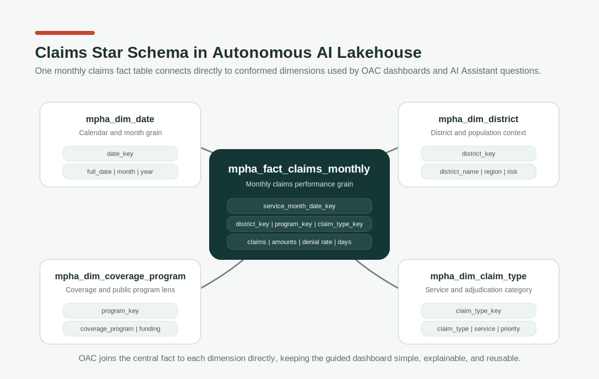

# Medallion Architecture Design

This workshop uses a public-health medallion architecture with a shared Bronze/Silver foundation and two Gold teaching paths:

`Raw files -> Bronze in AIDP -> Silver in AIDP -> Gold in Autonomous AI Lakehouse -> OAC and generative insights`

## Raw Landing Zone

Raw files are uploaded to Object Storage under folders such as `mpha/raw/`, `mpha/raw_json/`, `mpha/raw_spatial/`, and `mpha/documents/`. The simplified source contract uses five CSV files, one JSONL file, one GeoJSON file, and one DOCX document.

| Source file | Grain | Purpose |
| --- | --- | --- |
| `district_health_profile.csv` | District | Population, deprivation, elderly share, chronic-condition share, and income context. |
| `facility_provider_master.csv` | Facility/provider | Facility master, capacity targets, geography, and Healthcare Provider Accreditation fields. |
| `facility_operations_daily.csv` | Facility-day | Visits, ED demand, waits, occupancy, staffing, satisfaction, and daily quality-event measures. |
| `population_health_weekly.csv` | District-week-age group | Immunization campaign measures plus respiratory surveillance in one weekly population-health file. |
| `claims_membership_disbursement.csv` | Claim transaction | Claims, disbursement, membership eligibility, coverage program, and member risk segment fields. |
| `raw_json/facility_capacity_events.jsonl` | Facility-event | Command-center occupancy, waiting-room, triage, supply, and diversion events. |
| `raw_spatial/healthcare_service_areas.geojson` | Mixed GeoJSON features | District boundaries, facility points, and facility catchments in one spatial source. |
| `documents/MPHA_Winter_Respiratory_Response_Playbook.docx` | Document | 13-page synthetic operating playbook used for vector search and grounded chat. |

## Bronze Layer in AIDP

Bronze is schema-preserving and append-friendly. It should keep raw values intact and add ingestion metadata.

| Bronze table | Source | Logic |
| --- | --- | --- |
| `bronze_district_health_profile` | `district_health_profile.csv` | Preserve source district attributes and add ingestion metadata. |
| `bronze_facility_provider_master` | `facility_provider_master.csv` | Preserve facility/provider/accreditation rows and add ingestion metadata. |
| `bronze_facility_operations_daily` | `facility_operations_daily.csv` | Preserve daily operations and quality measures and add ingestion metadata. |
| `bronze_population_health_weekly` | `population_health_weekly.csv` | Preserve campaign and surveillance rows and add ingestion metadata. |
| `bronze_claims_membership_disbursement` | `claims_membership_disbursement.csv` | Preserve synthetic claim, member, and payment rows and add ingestion metadata. |
| `bronze_facility_capacity_events` | `facility_capacity_events.jsonl` | Preserve nested JSON event payloads and source event timestamps. |
| `bronze_healthcare_service_areas_geojson` | `healthcare_service_areas.geojson` | Preserve one mixed GeoJSON FeatureCollection for spatial analytics. |
| Document source | `MPHA_Winter_Respiratory_Response_Playbook.docx` | Chunk and vectorize the single playbook document for grounded chat. |

Recommended storage: Delta tables in AIDP under `mpha/bronze/`.

## Silver Layer in AIDP

Silver is cleaned, typed, validated, and conformed. It is still detailed enough to support multiple Gold marts.

| Silver table | Inputs | Logic |
| --- | --- | --- |
| `silver_district` | `bronze_district_health_profile` | Deduplicate district keys and type population, deprivation, income, and health-context fields. |
| `silver_facility_provider` | `bronze_facility_provider_master`, `silver_district` | Type facility and accreditation fields, standardize provider status, and join district context. |
| `silver_facility_day` | `bronze_facility_operations_daily`, `silver_facility_provider` | Parse `service_date`; cast measures; clamp rates; calculate wait variance, high occupancy, access risk score, and quality measures. |
| `silver_population_health_week` | `bronze_population_health_weekly` | Parse `week_start_date`; validate campaign and surveillance counts; calculate completion and no-show rates. |
| `silver_district_health_week` | `silver_population_health_week`, `silver_district` | Aggregate to district-week and calculate public-health pressure index. |
| `silver_claims_membership_disbursement` | `bronze_claims_membership_disbursement` | Parse claim, eligibility, renewal, and disbursement dates; cast amounts; standardize claim and payment status. |
| `silver_provider_accreditation` | `silver_facility_provider` | Publish provider accreditation fields for oversight and accreditation-risk facts. |
| `silver_facility_capacity_event` | `bronze_facility_capacity_events` | Parse event timestamp; type nested triage counts; calculate triage total, supply-alert count, and capacity pressure band. |
| `silver_spatial_feature` | `bronze_healthcare_service_areas_geojson` | Explode the single GeoJSON source and classify district, facility, and catchment features by `source_layer`. |
| `silver_playbook_chunk` | DOCX document vectorization | Standardize document id, chunk id, page, section, text, embedding model, and embedding JSON after chunking the single playbook. |

Recommended storage: Delta tables in AIDP under `mpha/silver/`.

## AIDP Workflow for Incremental Medallion Operation

The workshop teaches the medallion notebooks manually first, then introduces an AIDP Workflow to show how the same work becomes operational.

Recommended workflow asset:

- `workflows/aidp_incremental_medallion_workflow.md`
- `workflows/aidp_incremental_medallion_workflow.json`

Recommended workflow name:

`MPHA_INCREMENTAL_MEDALLION_FLOW`

Task graph:

1. `01_bronze_ingest`
   - Notebook: `01_Bronze_Public_Healthcare.ipynb`
   - Purpose: preserve raw CSV, JSONL, and GeoJSON sources with ingestion metadata.
2. `02_silver_conform`
   - Notebook: `02_Silver_Public_Healthcare.ipynb`
   - Purpose: type, validate, enrich, and conform healthcare detail.
3. `03_claims_star_schema_load`
   - Notebook: `04_Claims_Star_AI_Lakehouse_Load.ipynb`
   - Purpose: publish the guided Claims star schema into Autonomous AI Lakehouse.
4. `04_claims_star_validation`
   - Asset: `sql/claims_star_validation.sql`
   - Purpose: gate OAC, ML, and agent usage until table counts, joins, and orphan checks pass.
5. Optional branches:
   - `05_flat_gold_stage_optional` for broader flat Gold compatibility outputs.
   - `06_ml_scoring_optional` for Claims denial risk scoring after Gold validation.

Incremental run parameters:

| Parameter | Purpose |
| --- | --- |
| `run_mode` | Distinguishes `FULL_REFRESH` classroom execution from `INCREMENTAL` operational reruns. |
| `batch_id` | Labels the source batch and supports audit and replay. |
| `watermark_start` | Lower bound for new or changed records. |
| `watermark_end` | Upper bound for new or changed records. |
| `target_catalog` | External AI Lakehouse catalog used by the direct Gold load. |
| `target_schema` | Participant or team schema that receives the Gold star schema. |

Production incrementality:

- Bronze should append or deduplicate incoming raw records by source file, source key, and batch id.
- Silver should recompute only impacted records or partitions.
- Gold should upsert dimensions and refresh the affected monthly Claims fact grain.
- Validation should block downstream OAC, ML, and agent consumption when checks fail.

## Gold Layer in Autonomous AI Lakehouse

Gold is the business-serving layer. The recommended design is a dimensional star schema created in Autonomous AI Lakehouse using `sql/create_ai_lakehouse_dimensional_gold_schema.sql` after AIDP stages Gold outputs to Object Storage.

The package keeps the original flat Gold marts in `data/gold/` for quick validation, but the OAC semantic model should use the dimensional star outputs in `data/gold_dimensional/`.

### Workshop teaching paths

The workshop branches after Silver:

1. **Guided Claims star schema**
   - Silver source: `silver_claims_membership_disbursement`
   - Gold fact: `mpha_fact_claims_monthly`
   - Gold dimensions:
     - `mpha_dim_date`
     - `mpha_dim_district`
     - `mpha_dim_coverage_program`
     - `mpha_dim_claim_type`
   - Derived Gold outputs:
     - monthly aggregation by district, coverage program, and claim type
     - `claims_submitted`
     - `approved_claims`
     - `denied_claims`
     - `pending_claims`
     - `total_submitted_amount`
     - `total_approved_amount`
     - `total_paid_amount`
     - `avg_processing_days`
     - `denial_rate`
   - OAC outcome: the provided guided workbook is built only for this star schema.

2. **DIY Facility Access Daily star schema**
   - Silver sources: `silver_facility_day`, `silver_facility_provider`
   - Gold fact: `mpha_fact_facility_access_daily`
   - Gold dimensions:
     - `mpha_dim_date`
     - `mpha_dim_facility`
     - `mpha_dim_district`
     - `mpha_dim_pressure_band`
   - Derived Gold outputs:
     - `ed_wait_variance_minutes`
     - `outpatient_wait_variance_minutes`
     - `high_occupancy_flag`
     - `access_risk_score`
     - direct `district_key` retention in the fact for simple OAC joins
   - OAC outcome: participants create their own Facility Access Daily dashboard as the understanding check.

### Dimensional Gold Model

### Claims Star Schema Visual

The guided dashboard uses the Claims star schema above. `mpha_fact_claims_monthly` stays at monthly claims grain and carries direct foreign keys to `mpha_dim_date`, `mpha_dim_district`, `mpha_dim_coverage_program`, and `mpha_dim_claim_type`. This keeps the OAC self-service model intuitive: one fact in the center, four conformed dimensions around it, and business measures such as submitted claims, denied claims, paid amount, denial rate, and average processing days in the fact.

Shared dimensions:

- `mpha_dim_date`
- `mpha_dim_district`
- `mpha_dim_facility`
- `mpha_dim_age_group`
- `mpha_dim_quality_event`
- `mpha_dim_pressure_band`
- `mpha_dim_document_chunk`
- `mpha_dim_coverage_program`
- `mpha_dim_claim_type`
- `mpha_dim_member_segment`
- `mpha_dim_accreditation_status`

Facts and bridge tables:

- `mpha_fact_facility_access_daily`
- `mpha_fact_district_public_health_weekly`
- `mpha_fact_immunization_equity_weekly`
- `mpha_fact_quality_event_summary`
- `mpha_fact_spatial_access_insight`
- `mpha_fact_capacity_event`
- `mpha_bridge_chat_topic_chunk`
- `mpha_fact_claims_monthly`
- `mpha_fact_disbursement_monthly`
- `mpha_fact_membership_snapshot`
- `mpha_fact_provider_accreditation`

Star-schema relationship:

`mpha_fact_facility_access_daily -> mpha_dim_facility`

`mpha_fact_facility_access_daily -> mpha_dim_district`

District-grain facts join directly to `mpha_dim_district`; all dated facts reuse `mpha_dim_date`; multiple facts reuse `mpha_dim_pressure_band`.

### Flat Compatibility Marts

| Gold object | Inputs | Business logic |
| --- | --- | --- |
| `mpha_gold_facility_access_daily` | `silver_facility_day`, `silver_facility_provider` | Publish daily access, wait, capacity, staffing, satisfaction, and access risk measures by facility and district. |
| `mpha_gold_district_public_health_weekly` | `silver_district_health_week` | Publish public-health pressure, immunization completion, no-show, positivity, and respiratory ED demand by district-week. |
| `mpha_gold_immunization_equity_weekly` | `silver_population_health_week`, district profile | Publish campaign reach and equity measures by age group and district. |
| `mpha_gold_quality_event_summary` | `silver_facility_day`, `silver_facility_provider` | Aggregate daily quality-event measures by facility and district. |
| `mpha_gold_executive_overview` | `mpha_gold_facility_access_daily` | Publish district-level executive KPIs for OAC overview tiles. |
| `mpha_gold_spatial_access_insights` | `silver_spatial_feature`, `mpha_gold_district_public_health_weekly` | Publish residents-per-facility, pressure, catchment planning, and mobile-clinic action signals. |
| `mpha_gold_capacity_event_latest` | `silver_facility_capacity_event`, `silver_facility_provider` | Publish JSON capacity-event signals for real-time operations views. |
| `mpha_gold_document_chat_context` | `silver_playbook_chunk` | Publish document chunks and embedding metadata for chat with data and documents. |
| `mpha_gold_claims_denial_risk_scores` | `mpha_gold_claims_summary`, `mpha_gold_capacity_event_latest`, `mpha_gold_provider_accreditation_summary` | Publish optional denial-risk scoring outputs for claims review prioritization. |
| `mpha_gold_claims_summary` | `silver_claims_membership_disbursement` | Publish monthly claims submitted, approved, denied, pending, paid, and processing metrics by program and claim type. |
| `mpha_gold_disbursement_summary` | `silver_claims_membership_disbursement` | Publish monthly disbursement amount, payment status, funding source, payee type, and cycle-time metrics. |
| `mpha_gold_membership_summary` | `silver_claims_membership_disbursement` | Publish membership, eligibility, renewal, risk-segment, and chronic-condition metrics by program and district. |
| `mpha_gold_provider_accreditation_summary` | `silver_provider_accreditation` | Publish accreditation score, corrective actions, days to expiry, and accreditation risk band. |

Recommended serving objects still available in the package:

- `mpha_oac_star_claims`
- `mpha_oac_star_access_capacity`
- other `mpha_oac_star_*` views for extension, rehearsal, or follow-on demos

## Data Quality Rules

- Dates must parse as valid `YYYY-MM-DD` values.
- Visit, admission, discharge, test, appointment, and dose counts must be non-negative.
- Rates are clamped to valid ranges: `0 <= rate <= 1`.
- Bed occupancy is expected between `0` and `1.25` to allow surge-capacity cases.
- Facility and district joins must not create orphan Gold records.
- Daily quality-event measures must be non-negative.
- The single GeoJSON source must parse as a `FeatureCollection` with district, facility, or catchment keys and a `source_layer` property.
- JSON capacity events must have valid event timestamps and facility keys.
- Document chunks produced from the DOCX must include document id, chunk id, page number, section title, text, and embedding metadata.
- Synthetic claims must have valid member, facility, provider, district, program, service-date, and claim-status values.
- Disbursements must reference a claim and have non-negative payment amounts and cycle days.
- Membership rows must have unique synthetic member ids and valid renewal dates.
- Provider accreditation rows must have valid facility keys, score between 0 and 100, and non-negative corrective-action counts.

## Business Insight Outputs

The Gold layer is designed to answer:

- Which programs or claim types have the highest denial rate or slowest adjudication cycle?
- Which districts show the largest gaps between submitted and paid claim amounts?
- Which claim types are driving pending volume or long processing cycles?
- How should participants apply the same star-pattern to the Facility Access Daily fact?
- Facility-grain facts such as access, quality, capacity-event, and provider-accreditation facts carry `district_key` directly so OAC joins straight from facts to conformed dimensions.
