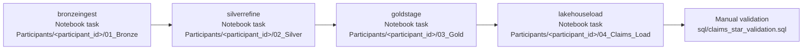

# AIDP Workflow - Incremental Medallion Flow

Use this runbook to create the Oracle AI Data Platform Workflow that orchestrates the public healthcare data-engineering notebooks. This section has been validated in the live AIDP workshop workspace.

Validated workflow name:

`MPHA_INCREMENTAL_MEDALLION_FLOW`

Validated workspace:

`E2EAIDPIndustryDemos`

Validated compute:

`E2EAIDPIndustrydemos`

## Why This Lab Exists

Participants first run the Bronze, Silver, Gold, and AI Lakehouse load notebooks manually so they understand each medallion layer. After that, the instructor shows how the same steps become a repeatable operational workflow.

The workflow is also where the incremental story becomes clear:

- Bronze receives the next raw batch.
- Silver conforms the impacted records.
- Gold stages business-ready outputs.
- The AI Lakehouse load appends only new Claims star schema rows by comparing generated keys to existing target keys.
- OAC, ML, and the Claims Policy Copilot consume the validated Gold layer.

## Validated Task Chain



> If participants upload the packaged `.ipynb` notebook wrappers instead of the `.py` source file, select **Notebook task** for that task. The task type must match the uploaded file type.

## Validated Task Settings

| Task | Type used in validated run | Workspace path | Depends on | Timeout |
| --- | --- | --- | --- | --- |
| `bronzeingest` | Notebook task | `/Workspace/Participants/<participant_id>/01_Bronze_Public_Healthcare.ipynb` | None | 30 minutes |
| `silverrefine` | Notebook task | `/Workspace/Participants/<participant_id>/02_Silver_Public_Healthcare.ipynb` | `bronzeingest` | 30 minutes |
| `goldstage` | Notebook task | `/Workspace/Participants/<participant_id>/03_Gold_Public_Healthcare.ipynb` | `silverrefine` | 30 minutes |
| `lakehouseload` | Notebook task | `/Workspace/Participants/<participant_id>/04_Claims_Star_AI_Lakehouse_Load.ipynb` | `goldstage` | 30 minutes |

Important behavior observed in AIDP:

- Set a task timeout before adding the next downstream task. The validated workflow uses `30` minutes; increase it if your compute startup is slower.
- Use simple alphanumeric task names such as `bronzeingest` and `lakehouseload`.
- Select the actual notebook or Python file row, not only the folder.
- Compute can show `Starting`; the task remains pending until the compute becomes active.
- Use **Repair run** to rerun only the failed downstream task after correcting a notebook.

## Step-by-Step Build

1. Open **AI Data Platform Workbench**.
2. Open the shared workshop workspace.
3. Open **Workflow** from the left navigation.
4. Create a workflow named `MPHA_INCREMENTAL_MEDALLION_FLOW`.


5. Configure the first task as `bronzeingest`.
6. Select Notebook task.
7. Select the Bronze file from `/Workspace/Participants/<participant_id>`.
8. Select the shared compute `E2EAIDPIndustrydemos`.
9. Enter timeout `30` minutes. Increase this value if your compute startup is slower.


10. Add `silverrefine`.
11. Select Notebook task.
12. Select the uploaded Silver notebook from `/Workspace/Participants/<participant_id>`.
13. Set dependency to `bronzeingest`.
14. Set timeout to `30` minutes.


15. Add `goldstage`.
16. Select Notebook task.
17. Select the uploaded Gold notebook from `/Workspace/Participants/<participant_id>`.
18. Set dependency to `silverrefine`.
19. Set timeout to `30` minutes.


20. Add `lakehouseload`.
21. Select Notebook task.
22. Select the AI Lakehouse load notebook from `/Workspace/Participants/<participant_id>`.
23. Confirm the notebook parameters use the same `participant_id`, `target_catalog = "goldailh"`, and the assigned `target_schema`, such as `MPHA_P17`.
24. Set dependency to `goldstage`.
25. Set timeout to `30` minutes.


26. Review the full chain before running.


27. Run the workflow.
28. Confirm that the run opens in graph view.
29. If compute is starting, wait until it becomes active and the first task begins.


30. Confirm the final `lakehouseload` node is successful.


## Validated AI Lakehouse Load Pattern

The connected AI Lakehouse catalog did not support table `TRUNCATE` or Spark SQL `DELETE` from the workflow notebook. To keep the workflow rerunnable, the load notebook now uses an append-only incremental pattern:

1. Build the Claims dimensions and monthly fact from Silver.
2. Read existing target keys from each AI Lakehouse table.
3. Left-anti join generated rows against existing target keys.
4. Insert only new rows.
5. Print `No new rows to write` when the rerun is already current.

Validated successful output from the repaired workflow:

```text
No new rows to write for goldailh.MPHA_P17.mpha_dim_date
No new rows to write for goldailh.MPHA_P17.mpha_dim_district
No new rows to write for goldailh.MPHA_P17.mpha_dim_coverage_program
No new rows to write for goldailh.MPHA_P17.mpha_dim_claim_type
No new rows to write for goldailh.MPHA_P17.mpha_fact_claims_monthly
Claims star schema write complete in the connected Autonomous AI Lakehouse catalog.
```

## Repair Run Pattern

Use this only if one downstream task fails after upstream layers already succeeded.

1. Open the failed workflow run.
2. Click **Repair run**.
3. Select only the failed downstream task. For this workshop, select `lakehouseload` if Bronze, Silver, and Gold already succeeded.
4. Click **Run repair**.
5. Confirm the repaired task turns green.


## Instructor Talk Track

Use the first run to teach the operational shape:

1. Bronze is the replayable landing layer.
2. Silver is the quality and conformance layer.
3. Gold is the business-serving layer.
4. AI Lakehouse is the serving target for OAC, ML, and agents.
5. AIDP Workflow turns notebooks into a governed run sequence.

Use the rerun or repair run to explain incrementality:

1. Repeated runs must be idempotent.
2. The AI Lakehouse connector may not support destructive reset operations through Spark.
3. The workshop load notebook therefore skips target keys that already exist.
4. In production, the same idea evolves into dimension upsert and fact-grain refresh logic.
5. Validation gates should run before OAC, ML, or agent experiences consume the new Gold state.

## Validation After Workflow Success

Run `sql/claims_star_validation.sql` after the workflow succeeds.

Expected checks:

- each Claims star schema table has rows
- fact rows have matching dimension rows
- the joined business preview returns service month, district, program, claim type, submitted claims, and denial rate
